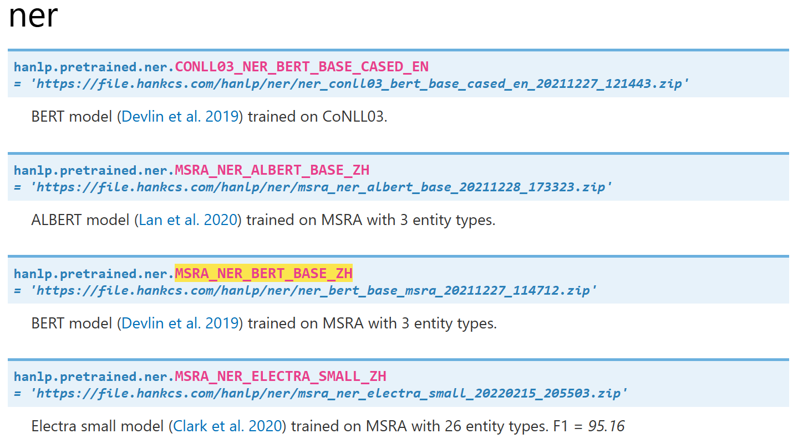

# HanLP实验

**部署位置**：windows

**conda环境**：kag_py10 (考虑到后续可以集成在kag里面)

根据HanLP官方文件说法，如果追求精度和速度，最好采用单任务，所以优先测试单任务情况。

### 实验一：命名实体识别单任务

实验数据：

```
深圳南山今日（8日）發生巴士撞上巴士站，事後釀成2死1傷。深圳公安通報事件。通報指出，2月8日10時許，在南山區沙河西路茶光村公交站，一公交車入站停靠時因司機突發疾病與站台發生碰撞，造成3名候車乘客受傷，其中2人經搶救無效死亡。經對公交車司機進行呼氣式酒精測試，結果為0mg/100ml。目前，事故正在進一步調查處理
```

HanLP针对命名实体识别任务提供了4个模型：

```
{'MSRA_NER_BERT_BASE_ZH': 'https://file.hankcs.com/hanlp/ner/ner_bert_base_msra_20211227_114712.zip', 
'MSRA_NER_ALBERT_BASE_ZH': 'https://file.hankcs.com/hanlp/ner/msra_ner_albert_base_20211228_173323.zip', 'MSRA_NER_ELECTRA_SMALL_ZH': 'https://file.hankcs.com/hanlp/ner/msra_ner_electra_small_20220215_205503.zip', 'CONLL03_NER_BERT_BASE_CASED_EN': 'https://file.hankcs.com/hanlp/ner/ner_conll03_bert_base_cased_en_20211227_121443.zip'}
```



这里选择第一个：MSRA_NER_BERT_BASE_ZH，选择我比较熟悉的谷歌BERT模型，也是Transform架构。模型大小为362MB

MSRA和CONLL03代表不同数据集，MSRA以中文为主、CONLL03以英文为主。

期间修复了各种参数bug，然后结果：

```
[[('深圳南山今日（8日）發生巴士撞上巴士站，事後釀成2死1傷。深圳公安通報事件。通報指出，2月8日10時許，在南山區沙河西路茶光村公交站，一公交車入站停靠時因司機突發疾病與站台發生碰撞，造成3名候車乘客受傷，其中2人經搶救無效死亡。經對公交車司機進行呼氣式酒精測試，結果為0mg/100ml。目前，事故正在進一步調查處理中。', 'NS', 0, 1)]]
```

显然识别失败

看一下终端的输出：

```
(kag_py10) PS C:\Users\dawna\Desktop\github\KAG\kag\examples\DawnQwenHongKong\HanLP> python .\test_nameEntity.py
Some weights of the PyTorch model were not used when initializing the TF 2.0 model TFBertModel: ['cls.predictions.transform.LayerNorm.bias', 'cls.predictions.transform.dense.weight', 'cls.predictions.transform.LayerNorm.weight', 'cls.predictions.transform.dense.bias', 'cls.seq_relationship.bias', 'cls.seq_relationship.weight', 'cls.predictions.bias']
- This IS expected if you are initializing TFBertModel from a PyTorch model trained on another task or with another architecture (e.g. initializing a TFBertForSequenceClassification model from a BertForPreTraining model).
- This IS NOT expected if you are initializing TFBertModel from a PyTorch model that you expect to be exactly identical (e.g. initializing a TFBertForSequenceClassification model from a BertForSequenceClassification model).
All the weights of TFBertModel were initialized from the PyTorch model.
If your task is similar to the task the model of the checkpoint was trained on, you can already use TFBertModel for predictions without further training.
2025-02-13 10:23:16 WARNING Input tokens ['深圳南山今日（8日）發生巴士撞上巴士站，事後釀成2死1傷。深圳公安通報事件。通報指出，2月8日10時許，在南山區沙河西路茶光村公交站，一公
交車入站停靠時因司機突發疾病與站台發生碰撞，造成3名候車乘客受傷，其中2人經搶救無效死亡。經對公交車司機進行呼氣式酒精測試，結果為0mg/100ml。目前，事故正在進一步調查處理中。'] 
exceed the max sequence length of 126. The exceeded part will be truncated and ignored. You are recommended to split your long text into several sentences within 126 tokens beforehand.
[[('深圳南山今日（8日）發生巴士撞上巴士站，事後釀成2死1傷。深圳公安通報事件。通報指出，2月8日10時許，在南山區沙河西路茶光村公交站，一公交車入站停靠時因司機突發疾病與站台發生
碰撞，造成3名候車乘客受傷，其中2人經搶救無效死亡。經對公交車司機進行呼氣式酒精測試，結果為0mg/100ml。目前，事故正在進一步調查處理中。', 'NS', 0, 1)]]
```

有两个问题，一个是**PyTorch 模型权重未完全使用**，另一个是**输入文本的长度超过了模型的最大序列长度（126 个 token）**

### 实验二：

MSRA_NER_BERT_BASE_ZH模型需要pytorch参数和tensorflow参数，我再mac和官方Colab上都运行失败了，干脆直接换成更简单的MSRA_NER_ELECTRA_SMALL_ZH模型。

实验结果：

```
[[('深', 'PERSON', 0, 1)], [('圳', 'LOCATION', 0, 1)], [('南', 'PERSON', 0, 1)], [], [], [('日', 'LOCATION', 0, 1)], [], [], [('日', 'LOCATION', 0, 1)], [], [], [], [('巴', 'PERSON', 0, 1)], [('士', 'PERSON', 0, 1)], [], [], [('巴', 'PERSON', 0, 1)], [('士', 'PERSON', 0, 1)], [], [], [], [], [], [], [], [], [], [], [], [('深', 'PERSON', 0, 1)], [('圳', 'LOCATION', 0, 1)], [], [('安', 'PERSON', 0, 1)], [], [], [], [], [], [], [], [], [], [], [], [('月', 'LOCATION', 0, 1)], [], [('日', 'LOCATION', 0, 1)], [], [], [], [], [], [], [('南', 'PERSON', 0, 1)], [], [], [('沙', 'PERSON', 0, 1)], [('河', 'LOCATION', 0, 1)], [('西', 'LOCATION', 0, 1)], [], [], [], [], [], [], [], [], [], [], [], [], [], [], [], [], [], [], [('司', 'PERSON', 0, 1)], [], [], [], [], [], [], [], [('台', 'LOCATION', 0, 1)], [], [], [], [], [], [], [], [], [], [], [], [], [], [], [], [], [], [('中', 'LOCATION', 0, 
1)], [], [], [], [], [], [], [], [], [], [], [], [], [], [], [], [('司', 'PERSON', 0, 1)], [], [], [], [], [], [], [], [], [], [], [], [], [], [], [], [], [], [], [], [], [], [], [], [], [], [], [], [], [], [], [], [], [], [], [], [('查', 'PERSON', 0, 1)], [], []]
```

再换成MSRA_NER_ALBERT_BASE_ZH模型，结果：

```
[('深圳', 'NS', 0, 2), ('南山', 'NS', 2, 4), ('深圳', 'NS', 29, 31), ('南山區', 'NS', 53, 56), ('沙河西路', 'NS', 56, 60), ('茶光村公交站', 'NS', 60, 66)]
```

都不尽人意，得检查一下自己是不是哪里做错了。

经过排查，发现**命名实体识别单任务**的输入必须是已分词的句子，比如：

```
["2021年", "HanLPv2.1", "为", "生产", "环境", "带来", "次", "世代", "最", "先进", "的", "多", "语种", "NLP", "技术", "。"]
```

这意味着必须在实体识别之前，加入一个分词模型。

### 实验三：切换成多任务

单任务的输入必须是已经分词好的数据格式，所以这里切换成多任务（多任务包含分词步骤，如果项目对分词有特殊要求，后期还可以添加自定义分词模型）。

多任务提供了更多的模型组合：

```
{'OPEN_TOK_POS_NER_SRL_DEP_SDP_CON_ELECTRA_SMALL_ZH': 'https://file.hankcs.com/hanlp/mtl/open_tok_pos_ner_srl_dep_sdp_con_electra_small_20201223_035557.zip',
 'OPEN_TOK_POS_NER_SRL_DEP_SDP_CON_ELECTRA_BASE_ZH': 'https://file.hankcs.com/hanlp/mtl/open_tok_pos_ner_srl_dep_sdp_con_electra_base_20201223_201906.zip',
 'CLOSE_TOK_POS_NER_SRL_DEP_SDP_CON_ELECTRA_SMALL_ZH': 'https://file.hankcs.com/hanlp/mtl/close_tok_pos_ner_srl_dep_sdp_con_electra_small_20210111_124159.zip',
 'CLOSE_TOK_POS_NER_SRL_DEP_SDP_CON_ELECTRA_BASE_ZH': 'https://file.hankcs.com/hanlp/mtl/close_tok_pos_ner_srl_dep_sdp_con_electra_base_20210111_124519.zip',
 'CLOSE_TOK_POS_NER_SRL_DEP_SDP_CON_ERNIE_GRAM_ZH': 'https://file.hankcs.com/hanlp/mtl/close_tok_pos_ner_srl_dep_sdp_con_ernie_gram_base_aug_20210904_145403.zip',
 'UD_ONTONOTES_TOK_POS_LEM_FEA_NER_SRL_DEP_SDP_CON_MT5_SMALL': （实测已经删除）
 'https://file.hankcs.com/hanlp/mtl/ud_ontonotes_tok_pos_lem_fea_ner_srl_dep_sdp_con_mt5_small_20210228_123458.zip',
 'UD_ONTONOTES_TOK_POS_LEM_FEA_NER_SRL_DEP_SDP_CON_XLMR_BASE': 'https://file.hankcs.com/hanlp/mtl/ud_ontonotes_tok_pos_lem_fea_ner_srl_dep_sdp_con_xlm_base_20210602_211620.zip',
 'NPCMJ_UD_KYOTO_TOK_POS_CON_BERT_BASE_CHAR_JA': 'https://file.hankcs.com/hanlp/mtl/npcmj_ud_kyoto_tok_pos_ner_dep_con_srl_bert_base_char_ja_20210914_133742.zip'}
```

甚至包括日语模型：NPCMJ_UD_KYOTO_TOK_POS_CON_BERT_BASE_CHAR_JA

**下面分别列出各个模型的测试结果**：

模型大小是按照压缩包计算（压缩包主要内容是模型参数，虽然也有一些配置文件，但是配置文件大小可以忽略不计）

ner四元组代表:[命名实体, 类型标签, 起始下标, 终止下标]

模型名称开头代表不同的数据集

OPEN_TOK_POS_NER_SRL_DEP_SDP_CON_ELECTRA_SMALL_ZH   **85.4MB** 测试结果：抽取13个实体

```shell
{
  "tok": [
    ["深圳", "南山", "今日", "（", "8日", "）", "發生", "巴士", "撞上", "巴士站", "，", "事", "後", "釀成", "2", "死", "1", "傷", "。", "深圳", "公安", "通報", "事件", "。", "通報", "指出", "，", "2月", "8日", "10時", "許", "，", "在", "南山區", "沙河西路", "茶光村", "公交站", "，", "一", "公交車", "入站", "停靠", "時", "因", "司機", "突發", "疾病", "與", "站台", "發生", "碰撞", "，", "造成", "3", "名", "候車", "乘客", "受傷", "，", "其中", "2", "人", "經", "搶救", "無效", "死亡", "。", "經", "對", "公交車", "司機", "進行", "呼氣式", "酒精", "測試", "，", "結果", "為", "0", "mg", "/", "100ml", "。", "目前", "，", "事故", "正在", "進一步", "調查", "處理"]
  ],
  "ner": [
    [["深圳", "LOCATION", 0, 1], ["南山", "LOCATION", 1, 2], ["今日", "DATE", 2, 3], ["8日", "DATE", 4, 5], ["深圳", "LOCATION", 19, 20], ["2月", "DATE", 27, 28], ["8日", "DATE", 28, 29], ["10時", "TIME", 29, 30], ["南山區", "LOCATION", 33, 34], ["沙河西路", "LOCATION", 34, 35], ["茶光村公交站", "LOCATION", 35, 37], ["3", "INTEGER", 53, 54], ["2", "INTEGER", 60, 61]]
  ]
}
```

OPEN_TOK_POS_NER_SRL_DEP_SDP_CON_ELECTRA_BASE_ZH  **418.7MB** 测试结果： 抽取14个实体

```shell
{
  "tok": [
    ["深圳", "南山", "今日", "（", "8日", "）", "發生", "巴士", "撞上", "巴士站", "，", "事後", "釀成", "2", "死", "1", "傷", "。", "深圳", "公安", "通報", "事件", "。", "通報", "指出", "，", "2月", "8日", "10時", "許", "，", "在", "南山區", "沙河", "西路", "茶光村", "公交站", "，", "一", "公交車", "入站", "停靠", "時", "因", "司機", "突發", "疾病", "與", "站台", "發生", "碰撞", "，", "造成", "3", "名", "候車", "乘客", "受傷", "，", "其中", "2", "人", "經", "搶救", "無效", "死亡", "。", "經", "對", "公交車", "司機", "進行", "呼氣式", "酒精", "測試", "，", "結果", "為", "0", "mg", "/", "100ml", "。", "目前", "，", "事故", "正", "在", "進一步", "調查", "處理"]
  ],
  "ner": [
    [["深圳", "LOCATION", 0, 1], ["南山", "LOCATION", 1, 2], ["今日", "DATE", 2, 3], ["8日", "DATE", 4, 5], ["2", "INTEGER", 13, 14], ["深圳", "LOCATION", 18, 19], ["2月", "DATE", 26, 27], ["8日", "DATE", 27, 28], ["10時", "TIME", 28, 29], ["南山區", "LOCATION", 32, 33], ["沙河西路", "LOCATION", 33, 35], ["茶光村公交站", "LOCATION", 35, 37], ["3", "INTEGER", 53, 54], ["2", "INTEGER", 60, 61]]
  ]
}
```

CLOSE_TOK_POS_NER_SRL_DEP_SDP_CON_ELECTRA_SMALL_ZH   **114.3MB**测试结果：  抽取16个，["0mg/100ml", "WWW", 79, 80]抽取错误，["3", "INTEGER", 54, 55], ["2", "INTEGER", 61, 62]无意义抽取，["茶光村公交站", "ORGANIZATION", 35, 37]应该是地名

```shell
{
  "tok/fine": [
    ["深圳", "南山", "今日", "（", "8日", "）", "發生", "巴士", "撞", "上", "巴士站", "，", "事後", "釀成", "2", "死", "1", "傷", "。", "深圳", "公安", "通報", "事件", "。", "通報", "指出", "，", "2月", "8日", "10時", "許", "，", "在", "南山區", "沙河西路", "茶光村", "公交站", "，", "一", "公交車", "入", "站", "停靠", "時", "因", "司機", "突發", "疾病", "與", "站台", "發生", "碰撞", "，", "造成", "3", "名", "候車", "乘客", "受傷", "，", "其中", "2", "人", "經", "搶救", "無效", "死亡", "。", "經", "對", "公交車", "司機", "進行", "呼氣式", "酒精", "測試", "，", "結果", "為", "0mg/100ml", "。
", "目前", "，", "事故", "正在", "進一步", "調查", "處理"]
  ],
  "ner/msra": [
    [["深圳", "LOCATION", 0, 1], ["南山", "LOCATION", 1, 2], ["今日", "DATE", 2, 3], ["8日", "DATE", 4, 5], ["2", "INTEGER", 14, 15], ["深圳", "LOCATION", 19, 20], ["公安", "ORGANIZATION", 20, 21], ["2月", "DATE", 27, 28], ["8日", "DATE", 28, 29], ["10時", "TIME", 29, 30], ["南山區", "LOCATION", 33, 34], ["沙河西路", "LOCATION", 34, 35], ["茶光村公交站", "ORGANIZATION", 35, 37], ["3", "INTEGER", 54, 55], ["2", "INTEGER", 61, 62], ["0mg/100ml", "WWW", 79, 80]]
  ]
}
```

CLOSE_TOK_POS_NER_SRL_DEP_SDP_CON_ELECTRA_BASE_ZH **467.9MB**测试表现：抽取15个实体，但是["0mg/100ml", "WWW", 79, 80]抽取错误，["3", "INTEGER", 54, 55], ["2", "INTEGER", 61, 62] 无意义抽取

```shell
{
  "tok/fine": [
    ["深圳", "南山", "今日", "（", "8日", "）", "發生", "巴士", "撞", "上", "巴士站", "，", "事後", "釀成", "2", "死", "1", "傷", "。", "深圳", "公安", "通報", "事件", "。", 
"通報", "指出", "，", "2月", "8日", "10時", "許", "，", "在", "南山區", "沙河西路", "茶光村", "公交站", "，", "一", "公交車", "入", "站", "停靠", "時", "因", "司機", "突發", 
"疾病", "與", "站台", "發生", "碰撞", "，", "造成", "3", "名", "候車", "乘客", "受傷", "，", "其中", "2", "人", "經", "搶救", "無效", "死亡", "。", "經", "對", "公交車", "司機", "進行", "呼氣式", "酒精", "測試", "，", "結果", "為", "0mg/100ml", "。", "目前", "，", "事故", "正在", "進一步", "調查", "處理"]
  ],
  "ner/msra": [
    [["深圳", "LOCATION", 0, 1], ["南山", "LOCATION", 1, 2], ["今日", "DATE", 2, 3], ["8日", "DATE", 4, 5], ["2", "INTEGER", 14, 15], ["深圳", "LOCATION", 19, 20], ["2月", "DATE", 27, 28], ["8日", "DATE", 28, 29], ["10時", "TIME", 29, 30], ["南山區", "LOCATION", 33, 34], ["沙河西路", "LOCATION", 34, 35], ["茶光村公交站", "LOCATION", 35, 37], ["3", "INTEGER", 54, 55], ["2", "INTEGER", 61, 62], ["0mg/100ml", "WWW", 79, 80]]
  ]
}
```

CLOSE_TOK_POS_NER_SRL_DEP_SDP_CON_ERNIE_GRAM_ZH  **448MB** 测试表现：抽取14个实体，公安组织没有抽取

```shell
{
  "tok/fine": [
    ["深圳", "南山", "今日", "（", "8日", "）", "發生", "巴士", "撞", "上", "巴士站", "，", "事後", "釀成", "2", "死", "1", "傷", "。", "深圳", "公安", "通報", "事件", "。", "通報", "指出", "，", "2月", "8日", "10時", "許", "，", "在", "南山區", "沙河西路", "茶光村", "公交站", "，", "一", "公交車", "入", "站", "停靠", "時", "因", "司機", "突發", 
"疾病", "與", "站台", "發生", "碰撞", "，", "造成", "3", "名", "候車", "乘客", "受傷", "，", "其中", "2", "人", "經", "搶救", "無效", "死亡", "。", "經", "對", "公交車", "司機", "進行", "呼氣式", "酒精", "測試", "，", "結果", "為", "0mg/100ml", "。", "目前", "，", "事故", "正在", "進一步", "調查", "處理"]
  ],
  "ner/msra": [
    [["深圳", "LOCATION", 0, 1], ["南山", "LOCATION", 1, 2], ["今日", "DATE", 2, 3], ["8日", "DATE", 4, 5], ["2", "INTEGER", 14, 15], ["深圳", "LOCATION", 19, 20], ["2月", "DATE", 27, 28], ["8日", "DATE", 28, 29], ["10時", "TIME", 29, 30], ["南山區", "LOCATION", 33, 34], ["沙河西路", "LOCATION", 34, 35], ["茶光村公交站", "LOCATION", 35, 37], ["3", "INTEGER", 54, 55], ["2", "INTEGER", 61, 62]]
  ]
}
```

UD_ONTONOTES_TOK_POS_LEM_FEA_NER_SRL_DEP_SDP_CON_XLMR_BASE **1.1GB** 测试表现：时间抽取还不错，加入了新的CARDINAL基数

```shell
{
  "tok": [
    ["深圳", "南山", "今日（8日）", "發生", "巴士", "撞上", "巴士", "站", "，", "事後", "釀成2死1傷", "。", "深圳", "公安", "通報", "事件", "。", "通報", "指出", "，2月8日10 時", "許", "，在", "南山區", "沙河", "西路", "茶光村", "公交", "站", "，一", "公交", "車", "入站", "停靠", "時", "因", "司機", "突發", "疾病", "與", "站台", "發生", "碰撞", "，", "造成3", "名", "候車", "乘客", "受傷", "，", "其中2", "人", "經", "搶救", "無效", "死亡", "。", "經", "對", "公交", "車", "司機", "進行", "呼氣", "式", "酒精", "測試", "，", "結果為0mg", "/", "100ml", "。", "目前", "，", "事故", "正", "在", "進", "一", "步", "調查", "處理"]
  ],
  "ner": [
    [["深圳", "GPE", 0, 1], ["南山", "GPE", 1, 2], ["今日（8日）", "DATE", 2, 3], ["深圳 公安", "ORG", 12, 14], ["，2月8日10時", "DATE", 19, 20], ["沙河", "GPE", 23, 24], [" 茶光村", "FAC", 25, 26], ["公交 站", "FAC", 26, 28], ["，一", "CARDINAL", 28, 29], ["站台", "FAC", 39, 40], ["其中2", "CARDINAL", 49, 50], ["100ml", "CARDINAL", 69, 70]]     
  ]
}
```

经过简单的测试，除了最后一个模型必须按照ONTONOTES词典抽取，其他模型都是默认按照msra词典抽取。

**ONTONOTES词典**：

| TAG          | Description                                          |
| ------------ | ---------------------------------------------------- |
| PERSON       | People, including fictional                          |
| NORP         | Nationalities or religious or political groups       |
| FACILITY     | Buildings, airports, highways, bridges, etc.         |
| ORGANIZATION | Companies, agencies, institutions, etc.              |
| GPE          | Countries, cities, states                            |
| LOCATION     | Non-GPE locations, mountain ranges, bodies of water  |
| PRODUCT      | Vehicles, weapons, foods, etc. (Not services)        |
| EVENT        | Named hurricanes, battles, wars, sports events, etc. |
| WORK OF ART  | Titles of books, songs, etc.                         |
| LAW          | Named documents made into laws                       |
| DATE         | Absolute or relative dates or periods                |
| TIME         | Times smaller than a day                             |
| PERCENT      | Percentage                                           |
| MONEY        | Monetary values, including unit                      |
| QUANTITY     | Measurements, as of weight or distance               |
| ORDINAL      | “first”, “second”                                    |
| CARDINAL     | Numerals that do not fall under another type         |

**msra词典**：

| Category | Subcategory    | Tag-set of Format-1 | Tag-set of Format-2 |
| -------- | -------------- | ------------------- | ------------------- |
| NAMEX    | Person         | P                   | PERSON              |
|          | Location       | L                   | LOCATION            |
|          | Organization   | 〇                  | ORGANIZATION        |
| TIMEX    | Date           | dat                 | DATE                |
|          | Duration       | dur                 | DURATION            |
|          | Time           | tim                 | TIME                |
| NUMEX    | Percent        | per                 | PERCENT             |
|          | Money          | mon                 | MONEY               |
|          | Frequency      | fre                 | FREQUENCY           |
|          | Integer        | int                 | INTEGER             |
|          | Fraction       | fra                 | FRACTION            |
|          | Decimal        | dec                 | DECIMAL             |
|          | Ordinal        | ord                 | ORDINAL             |
|          | Rate           | rat                 | RATE                |
| MEASUREX | Age            | age                 | AGE                 |
|          | Weight         | wei                 | WEIGHT              |
|          | Length         | len                 | LENGTH              |
|          | Temperature    | tem                 | TEMPERATURE         |
|          | Angle          | ang                 | ANGLE               |
|          | Area           | are                 | AREA                |
|          | Capacity       | cap                 | CAPACITY            |
|          | Speed          | spe                 | SPEED               |
|          | Acceleration   | acc                 | ACCELERATION        |
|          | Other measures | mea                 | MEASURE             |
| ADDREX   | Email          | ema                 | EMAIL               |
|          | Phone          | pho                 | PHONE               |
|          | Fax            | fax                 | FAX                 |
|          | Telex          | tel                 | TELEX               |
|          | WWW            | WWW                 | WWW                 |
|          | Postalcode     | pos                 | POSTALCODE          |

感觉ontonotes词典更加简单高效。

### 实验四：添加自定义词典

HanLP支持自定义词典，我让CLOSE_TOK_POS_NER_SRL_DEP_SDP_CON_ELECTRA_SMALL_ZH 这个模型按照ontonotes词典进行抽取，结果如下：

```shell
{
  "tok/fine": [
    ["深圳", "南山", "今日", "（", "8日", "）", "發生", "巴士", "撞", "上", "巴士站", "，", "事後", "釀成", "2", "死", "1", "傷", "。", "深圳", "公安", "通報", "事件", "。", 
"通報", "指出", "，", "2月", "8日", "10時", "許", "，", "在", "南山區", "沙河西路", "茶光村", "公交站", "，", "一", "公交車", "入", "站", "停靠", "時", "因", "司機", "突發", 
"疾病", "與", "站台", "發生", "碰撞", "，", "造成", "3", "名", "候車", "乘客", "受傷", "，", "其中", "2", "人", "經", "搶救", "無效", "死亡", "。", "經", "對", "公交車", "司 機", "進行", "呼氣式", "酒精", "測試", "，", "結果", "為", "0mg/100ml", "。", "目前", "，", "事故", "正在", "進一步", "調查", "處理"]
  ],
  "ner/ontonotes": [
    [["深圳", "GPE", 0, 1], ["南山", "GPE", 1, 2], ["今日", "DATE", 2, 3], ["8日", "DATE", 4, 5], ["2", "CARDINAL", 14, 15], ["深圳", "GPE", 19, 20], ["公安", "ORGANIZATION", 20, 21], ["2月8日", "DATE", 27, 29], ["10時", "TIME", 29, 30], ["南山區", "GPE", 33, 34], ["沙河西路", "LOC", 34, 35], ["茶光村", "GPE", 35, 36], ["3", "CARDINAL", 54, 55], ["2", "CARDINAL", 61, 62]]
  ]
}
```

显然“司机”没有抽取出来，在ontonotes词典基础上，添加白名单后，结果如下：

ner.dict_whitelist = {'司機': 'PERSON'}

```shell
{
  "tok/fine": [
    ["深圳", "南山", "今日", "（", "8日", "）", "發生", "巴士", "撞", "上", "巴士站", "，", "事後", "釀成", "2", "死", "1", "傷", "。", "深圳", "公安", "通報", "事件", "。", "通報", "指出", "，", "2月", "8日", "10時", "許", "，", "在", "南山區", "沙河西路", "茶光村", "公交站", "，", "一", "公交車", "入", "站", "停靠", "時", "因", "司機", "突發", "疾病", "與", "站台", "發生", "碰撞", "，", "造成", "3", "名", "候車", "乘客", "受傷", "，", "其中", "2", "人", "經", "搶救", "無效", "死亡", "。", "經", "對", "公交車", "司機", "進行", "呼氣式", "酒精", "測試", "，", "結果", "為", "0mg/100ml", "。", "目前", "，", "事故", "正在", "進一步", "調查", "處理"]
  ],
  "ner/ontonotes": [
    [["深圳", "GPE", 0, 1], ["南山", "GPE", 1, 2], ["今日", "DATE", 2, 3], ["8日", "DATE", 4, 5], ["2", "CARDINAL", 14, 15], ["深圳", "GPE", 19, 20], ["2月8日", "DATE", 27, 29], ["10時", "TIME", 29, 30], ["南山區", "GPE", 33, 34], ["沙河西路", "LOC", 34, 35], ["茶光村", "GPE", 35, 36], ["司機", "PERSON", 45, 46], ["3", "CARDINAL", 54, 55], ["2", "CARDINAL", 61, 62], ["司機", "PERSON", 71, 72]]
  ]
}
```

司机被正常抽取出来，但是被抽取了两次，因为分词阶段，就分了两个“司机”

可惜**CLOSE_TOK_POS_NER_SRL_DEP_SDP_CON_ELECTRA_SMALL_ZH**模型只能抽取中文，不支持英文，但是香港九龙地区是中英文混杂的情况。如果想用这个模型去抽取英文文档，需要再训练一个**ELECTRA_SMALL_EN**模型。同时在实际使用过程中，我们还需要判断该新闻文本内容属于中文还是英文，再丢给不同的模型去处理。

### 实验五：新模型

在翻阅官方文档时，发现一个模型：**UD_ONTONOTES_TOK_POS_LEM_FEA_NER_SRL_DEP_SDP_CON_MMINILMV2L12**

该模型支持130种语言，包括粤语，我觉得挺适合，拿来测试一下结果：

```shell
{
  "tok": [
    ["深圳", "南山", "今日", "（8", "日", "）", "發生", "巴士", "撞上", "巴士", "站", "，", "事後", "釀成", "2", "死", "1", "傷", "。", "深圳", "公安", "通報", "事件", "。", "通報", "指出", "，", "2月", "8日", "10", "時", "許", "，", "在", "南", "山區", "沙河", "西路", "茶光", "村", "公交", "站", "，", "一", "公交", "車", "入站", "停靠", "時", " 因", "司機", "突發", "疾病", "與", "站台", "發生", "碰撞", "，", "造成", "3", "名", "候車", "乘客", "受傷", "，", "其中", "2", "人", "經", "搶救", "無效", "死亡", "。", "經", "對", "公交", "車", "司機", "進行", "呼氣", "式", "酒精", "測試", "，", "結果", "為", "0", "mg", "/", "100", "ml", "。", "目前", "，", "事故", "正", "在", "進", "一", "步", "調查", "處理"]
  ],
  "ner": [
    [["深圳 南山", "FAC", 0, 2], ["2", "CARDINAL", 14, 15], ["1", "CARDINAL", 16, 17], ["深圳", "GPE", 19, 20], ["8日", "DATE", 28, 29], ["沙河", "GPE", 36, 37], ["3", "CARDINAL", 59, 60], ["0", "CARDINAL", 86, 87]]
  ]
}
```

太Low了，卧槽，分词分的太差劲了！关键是我想改分词器还改不了，因为多任务模型是绑定在一起训练的。

在试一试该模型的另一个版本：**UD_ONTONOTES_TOK_POS_LEM_FEA_NER_SRL_DEP_SDP_CON_MMINILMV2L6**

```shell
{
  "tok": [
    ["深圳", "南山", "今日", "（8", "日", "）", "發生", "巴士", "撞上", "巴士", "站", "，", "事後", "釀成", "2", "死", "1", "傷", "。", "深圳", "公安", "通報", "事件", "。", "通報", "指出", "，", "2月", "8日", "10", "時", "許", "，", "在", "南", "山區", "沙河西", "路", "茶光", "村", "公交", "站", "，", "一", "公交", "車", "入站", "停靠", "時", " 因", "司機", "突發", "疾病", "與", "站台", "發生", "碰撞", "，", "造成", "3", "名", "候車", "乘客", "受傷", "，", "其中", "2", "人", "經", "搶救", "無效", "死亡", "。", "經", "對", "公交", "車", "司機", "進行", "呼氣", "式", "酒精", "測試", "，", "結果", "為", "0", "mg", "/", "100", "ml", "。", "目前", "，", "事故", "正", "在", "進", "一", "步", "調查", "處理"]
  ],
  "ner": [
    [["深圳", "GPE", 0, 1], ["南山", "GPE", 1, 2], ["今日", "TIME", 2, 3], ["2", "CARDINAL", 14, 15], ["1", "CARDINAL", 16, 17], ["深圳", "GPE", 19, 20], ["2月 8日 10 時", "TIME", 27, 31], ["南", "GPE", 34, 35], ["沙河西", "GPE", 36, 37], ["茶光", "GPE", 38, 39], ["一", "CARDINAL", 43, 44], ["3", "CARDINAL", 59, 60], ["2", "CARDINAL", 66, 67], ["0", "CARDINAL", 86, 87], ["100 ml", "QUANTITY", 89, 91], ["一", "CARDINAL", 98, 99]]
  ]
}
```

感觉也一般，但是能接受

### 实验五：添加抽取黑名单

之前的实验抽取了太多的数字，看看能不能将单个数字删除了

ner.dict_blacklist = {'1','2','3','4','5','6','7','8','9','一'}

**UD_ONTONOTES_TOK_POS_LEM_FEA_NER_SRL_DEP_SDP_CON_MMINILMV2L6**抽取结果：

```shell
{
  "tok": [
    ["深圳", "南山", "今日", "（8", "日", "）", "發生", "巴士", "撞上", "巴士", "站", "，", "事後", "釀成", "2", "死", "1", "傷", "。", "深圳", "公安", "通報", "事件", "。", 
"通報", "指出", "，", "2月", "8日", "10", "時", "許", "，", "在", "南", "山區", "沙河西", "路", "茶光", "村", "公交", "站", "，", "一", "公交", "車", "入站", "停靠", "時", " 
因", "司機", "突發", "疾病", "與", "站台", "發生", "碰撞", "，", "造成", "3", "名", "候車", "乘客", "受傷", "，", "其中", "2", "人", "經", "搶救", "無效", "死亡", "。", "經", "對", "公交", "車", "司機", "進行", "呼氣", "式", "酒精", "測試", "，", "結果", "為", "0", "mg", "/", "100", "ml", "。", "目前", "，", "事故", "正", "在", "進", "一", "步", 
"調查", "處理"]
  ],
  "ner": [
    [["深圳", "GPE", 0, 1], ["南山", "GPE", 1, 2], ["今日", "TIME", 2, 3], ["深圳", "GPE", 19, 20], ["2月 8日 10 時", "TIME", 27, 31], ["南", "GPE", 34, 35], ["沙河西", "GPE", 36, 37], ["茶光", "GPE", 38, 39], ["司機", "PERSON", 50, 51], ["司機", "PERSON", 77, 78], ["0", "CARDINAL", 86, 87], ["100 ml", "QUANTITY", 89, 91]]
  ]
}
```

实验证明可以删除一些冗余的实体。

官方虽然提供了MMINILMV2L6这种多语种模型，但是官方也承认这些模型并没有单语种模型表现效果好。

### 总结

1. HanLP多任务模型可以直接从句子中识别出命名实体，根据实验结果，目前表现比较好的是CLOSE_TOK_POS_NER_SRL_DEP_SDP_CON_ELECTRA_SMALL_ZH模型

   **优点：**

   1. 该模型在ONTONOTES词典和msra词典下都有不错的表现
   2. 识别比较稳定，几乎每次结果都一样
   3. 官方虽然没有说支持粤语，但是在实测下，可以进行粤语命名实体识别任务

   **缺点：**

   1. 该模型只能支持中文，项目后续抽取英文的时候，需要额外引入英文版本模型
   2. 多任务模型不支持单个任务的微调。比如多任务模型的分词性能很差，我想对分词器进行一些微调，但这是做不到的

2. 单任务模型灵活性很大，我后期可以自建识别链条，对分词器、命名实体识别、词性标注、语种检测都可以采用不同的模型，但是工作量有些大，因为要结合实际数据搭配不同的模型组合，模型组合可太多了

3. HanLP不支持自定义词典，所有模型都在ONTONOTES词典和msra词典上训练，**这一点是最伤的**。但是支持白名单和黑名单，可以着重抽取关键词。

4. 后期可以将命名实体识别功能集成在KAG中，在实体抽取那一部分替换成HanLP，这样速度会快很多，大模型只需要负责实体对齐和关系抽取即可。

